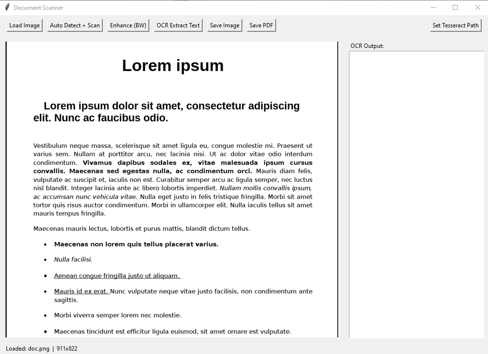
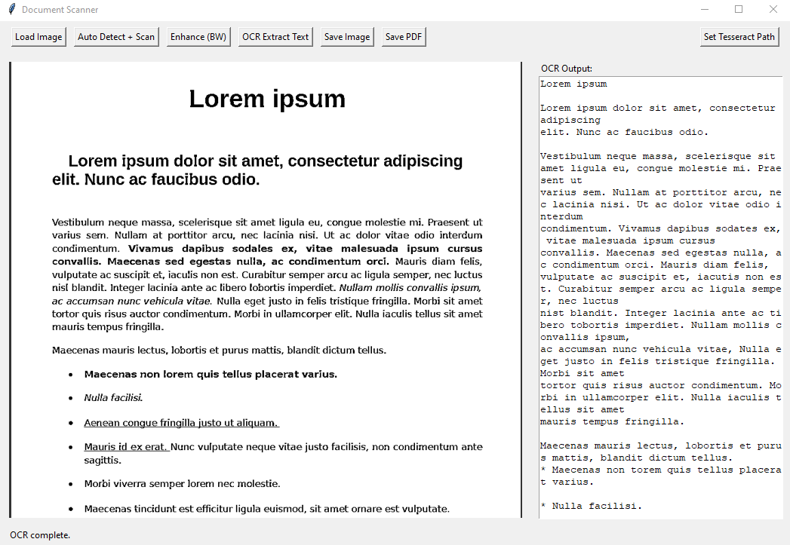

# Document_Scanner
Python desktop application with a Tkinter GUI that allows loading, scanning, enhancing, and extracting  text from documents using OpenCV and Tesseract OCR.

## Features
- Load document images (JPG/PNG/BMP)
- Automatic edge detection and perspective correction (transform to top-down view)
- Enhance readability (convert to black & white, adaptive threshold)
- Extract text using Tesseract OCR
- Save processed images as JPG/PNG/PDF
- Export scanned text to PDF

## Requirements
- Python 3.8+
- OpenCV (`opencv-python`)
- Pillow (`Pillow`)
- NumPy (`numpy`)
- PyTesseract (`pytesseract`)
- ReportLab (`reportlab`)

### Installation
```bash
pip install opencv-python Pillow numpy pytesseract reportlab
```

On Windows, install [Tesseract OCR](https://github.com/tesseract-ocr/tesseract) and update the path inside the code if needed:
```python
pytesseract.pytesseract.tesseract_cmd = r'C:\Program Files\Tesseract-OCR\tesseract.exe'
```

## Run
```bash
python document_scanner.py
```

## Usage Instructions
1. Click **Load Image** and select a document photo.
2. Use **Scan Document** to detect edges and correct perspective.
3. Apply **Enhance** to improve readability.
4. Click **Extract Text (OCR)** to recognize and display text.
5. Save results with **Save Image** or **Export PDF**.

   Screenshots

   

   
